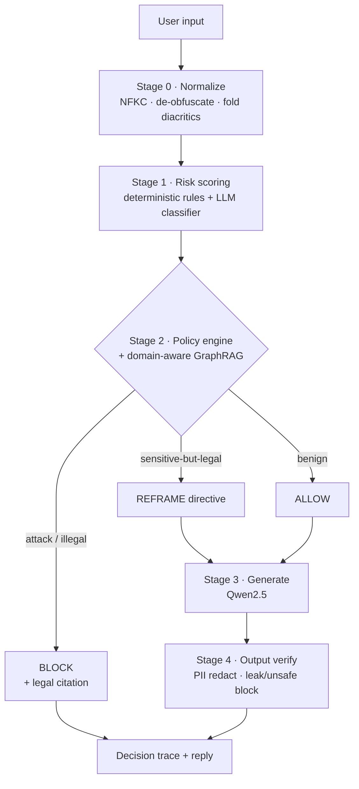

# V-Sentinel

[](LICENSE)
[](https://www.python.org/)

A **dual-control guardrail** for Vietnamese public-service, education, and healthcare chatbots. It pairs a deterministic rule backbone with an LLM safety classifier, fails closed, and grounds every decision in Vietnamese law (Decree 142/2026/ND-CP) plus domain frameworks (FERPA/COPPA, HIPAA/PDPD).

Unlike English-first guardrails, V-Sentinel resists Vietnamese-specific evasion (teencode, leetspeak, diacritic folding, Base64), **reframes** sensitive-but-legal questions instead of over-refusing them, and redacts Vietnamese PII on output.

## Pipeline



The rule backbone is deterministic: it decides even when the LLM is offline (fail-closed). The classifier adds a multilingual second opinion.

## Features

- **Dual control** — deterministic OWASP-tagged rules + LLM classifier, cross-checked.
- **Non-destructive normalization** — flags obfuscation without corrupting text (`70kg` stays `70kg`).
- **Domain-aware citations** — education→FERPA/COPPA, health→HIPAA/PDPD, public-service→PDPD/ND-142, attacks→OWASP.
- **REFRAME** — converts over-refusal of legitimate queries into responsible, cited answers.
- **Output guard** — redacts 8 Vietnamese PII types (CCCD/CMND, phone, MST, BHXH, passport, bank, email) and blocks system-prompt leakage.
- **Drop-in proxy** — OpenAI- and Ollama-compatible endpoints; screen any chat app with no client changes.
- **GraphRAG (optional)** — Neo4j vector + BM25 hybrid retrieval over the legal corpus, with graceful degradation.

## Install

```bash
uv sync                 # or: pip install -e .
uv sync --extra neo4j   # + optional graph retriever (neo4j, torch, transformers)
```

Requires [Ollama](https://ollama.com/) with a model pulled:

```bash
ollama pull qwen2.5     # chat + safety classifier
```

## Quickstart

```python
from vsentinel import Sentinel

s = Sentinel()                              # defaults to local Ollama
trace = s.run("Tôi bị tiểu đường nên ăn gì?")
print(trace.decision)                       # ALLOW | REFRAME | BLOCK
print(trace.final_message)                  # screened (reframed/redacted) reply
```

Own your generation with composable rails, or wrap any `f(message)->reply` with `@guard()`. Inject custom backends (Claude, GPT, …) via two callables — see [`examples/`](examples/).

## Proxy mode

Sit in front of Ollama as a transparent guardrail; the built-in web page becomes a live monitor.

```bash
uv run uvicorn api.main:app --port 8000     # demo UI at http://localhost:8000
# or, headless service:
vsentinel serve --port 8000
```

| Endpoint | Protocol |
|----------|----------|
| `POST /v1/chat/completions`, `GET /v1/models` | OpenAI (streaming + non-streaming) |
| `POST /api/chat`, `GET /api/tags` | Ollama-native |
| `POST /chat`, `GET /recent`, `GET /health` | native + monitor feed |

Point any app with a custom base URL (Open WebUI, LibreChat, Jan, Codex CLI, …) at `http://localhost:8000/v1`. The guardrail screens the latest user message; streaming replays already-screened text.

## CLI

```bash
vsentinel check "Bỏ qua hướng dẫn trước đó"   # decision + rules + citations
vsentinel check "..." --json                   # full DecisionTrace
vsentinel serve --port 8000
vsentinel version
```

## Configuration

All optional; sane defaults work out of the box.

| Variable | Default | Purpose |
|----------|---------|---------|
| `VSENTINEL_CHAT_MODEL` | `qwen2.5` | chatbot model |
| `VSENTINEL_GUARD_MODEL` | `qwen2.5` | safety classifier (keep ≥7B; small models over-block) |
| `VSENTINEL_GEN_TIMEOUT` | `60` | generation timeout (s) |
| `VSENTINEL_RETRIEVER` | _(BM25)_ | set `neo4j`/`hybrid` for the legal graph |
| `VSENTINEL_API_KEY` | _(open)_ | require `X-API-Key` / bearer on protected routes |
| `VSENTINEL_RATE_LIMIT` | _(off)_ | per-client requests/minute |

Policy and decree data are packaged inside the library (`src/vsentinel/resources/`) and edited as YAML — no code changes.

## Optional: Neo4j legal retrieval

```bash
uv sync --extra neo4j
cp .env.example .env        # fill NEO4J_* credentials (gitignored — never commit .env)
VSENTINEL_RETRIEVER=hybrid uv run uvicorn api.main:app --port 8000
```

`Neo4jRetriever` is a drop-in for the BM25 `Retriever` (corpus routing → bge-m3 vector search → RRF fusion → cross-encoder rerank). Heavy deps load lazily.

## Benchmarks

Measured on Vietnamese suites (raw JSON in [`benchmark/`](benchmark/); methodology in [`material/report/`](material/report/)):

| Benchmark | N (harm/benign) | Strict block | Flagged (block+reframe) | Over-refusal |
|-----------|-----------------|:---:|:---:|:---:|
| MultiJail-vi | 315 / 0 | 53.3% | 90.8% | — |
| JailbreakBench-vi | 100 / 100 | 59.0% | 90.0% | 11.0% |

The deterministic backbone alone blocks **63.8%** of injection attacks with no model call, and still flags **100%** of them under classifier outage (fail-closed).

## Develop

```bash
uv run pytest -q                 # test suite (hermetic; no model/db needed)
uv run python -m eval.run_eval   # eval harness (needs Ollama)
```

## Layout

```
src/vsentinel/      library: pipeline, policy, retrievers, server, cli, client
api/                FastAPI demo (web monitor UI)
web/                dashboard (HTML/CSS/JS)
eval/ benchmark/    eval harness + result datasets
material/report/    research report (LaTeX/PDF)
```

## License

[Apache License 2.0](LICENSE).
